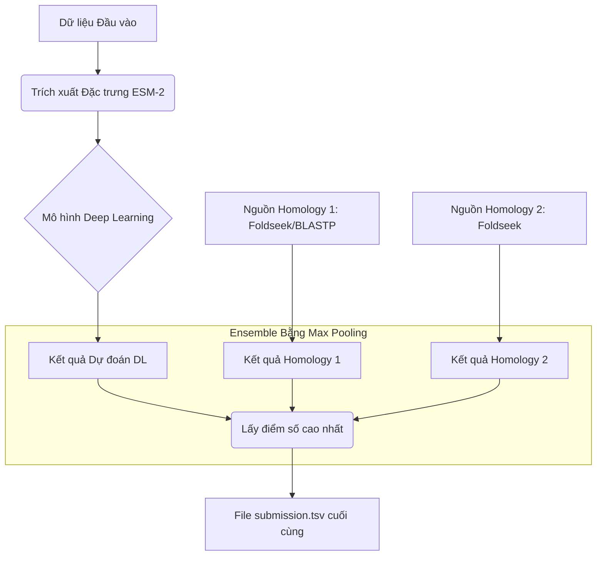

# Dự án Cuối kỳ: CAFA 6 - Dự đoán Chức năng Protein 


## 1. Tổng quan Dự án

Đây là repository mã nguồn cho dự án cuối kỳ môn học **INT3405 – Học máy**. Dự án tập trung vào việc giải quyết bài toán dự đoán chức năng protein trong cuộc thi **CAFA 6 (Critical Assessment of Functional Annotation)** trên nền tảng Kaggle.

Mục tiêu chính là xây dựng một pipeline học máy có khả năng gán các thuật ngữ Gene Ontology (GO terms) cho các trình tự protein chưa được chú thích với độ chính xác cao nhất có thể.

-   **Sinh viên thực hiện:** Nguyễn Minh Đức
-   **MSSV:** 23020049
-   **Giảng viên hướng dẫn:** Tạ Việt Cường

## 2. Kết quả Đạt được

Dự án đã trải qua nhiều vòng thử nghiệm và cải tiến, với kết quả cuối cùng được ghi nhận trên bảng xếp hạng của Kaggle như sau:

| Tên Nhóm (Kaggle)      | Public Score Cao Nhất | Thứ hạng (Public LB) | Phiên bản tốt nhất                                        |
| ---------------------- | --------------------- | -------------------- | --------------------------------------------------------- |
| `ABC_INT34057`         | **0.312**             | **326 / 1073**       | `01_Baseline_and_Ensemble_Best_Score.ipynb`               |

## 3. Phương pháp tiếp cận (Phiên bản tốt nhất)

Phương pháp đạt kết quả tốt nhất (0.312) là một pipeline kết hợp (ensemble) giữa Deep Learning và hai nguồn dữ liệu tương đồng (Homology) mạnh mẽ.



**Các bước chính:**
1.  **Trích xuất Đặc trưng:** Sử dụng vector embedding tiền huấn luyện từ mô hình ngôn ngữ protein **ESM-2**.
2.  **Mô hình Deep Learning:** Huấn luyện một mạng nơ-ron đơn giản với PyTorch.
3.  **Kết hợp Homology:** Lấy kết quả từ hai nguồn dữ liệu homology uy tín.
4.  **Ensemble:** Gộp kết quả từ 3 nguồn trên bằng kỹ thuật **Max Pooling** – lấy điểm số tin cậy cao nhất cho mỗi cặp `(Protein, GO Term)`.

## 4. Cấu trúc Repository

Repository được tổ chức một cách khoa học để dễ dàng theo dõi và kiểm tra.

```
.
├── notebooks/                  
│   ├── 01_Baseline_and_Ensemble_Best_Score.ipynb
│   ├── 02_Advanced_Post_Processing_Experiments.ipynb
│   └── 03_Experiment_Multi_Ontology.ipynb
│
├── report/
│   └── BaoCao_NguyenMinhDuc_23020049.pdf
│
├── .gitignore                                   
├── README.md                   
└── requirements.txt            
```

## 5. Hướng dẫn Tái tạo Kết quả (Score 0.312)

Đây là hướng dẫn chi tiết để chạy lại code và tạo ra file submission đạt điểm số cao nhất.

### **Yêu cầu:**
-   `Python 3.8+`
-   `Git`

### Bước 1: Tải mã nguồn

Clone repository này về máy của bạn:
```bash
git clone https://github.com/nmd29io/CAFA-6-TEAM-ABC_INT34057.git
cd CAFA-6-TEAM-ABC_INT34057
```

### Bước 2: Cài đặt Môi trường (Cực kỳ quan trọng)

Em đã chuẩn bị sẵn file `requirements.txt`. Chạy lệnh sau để cài đặt tất cả các thư viện cần thiết với đúng phiên bản:

```bash
pip install -r requirements.txt
```
*(**Lưu ý:** Nên thực hiện lệnh này trong một môi trường ảo - virtual environment - để tránh xung đột thư viện.)*

### Bước 3: Tải và Sắp xếp Dữ liệu

1.  **Tạo thư mục `notebooks/kaggle/input`** tại thư mục gốc của dự án:

2.  **Tải các bộ dữ liệu từ Kaggle** và giải nén vào đúng các thư mục con bên trong `kaggle/input`:
    -   **Dữ liệu chính cuộc thi:**
        -   **Link:** [https://www.kaggle.com/competitions/cafa-6-protein-function-prediction](https://www.kaggle.com/competitions/cafa-6-protein-function-prediction)
        -   **Giải nén vào:** `kaggle/input/cafa-6-protein-function-prediction/`
    -   **Dữ liệu Embedding ESM-2:**
        -   **Link:** [https://www.kaggle.com/datasets/zcalvin/cafa6-protein-embeddings-esm2](https://www.kaggle.com/datasets/zcalvin/cafa6-protein-embeddings-esm2)
        -   **Giải nén vào:** `kaggle/input/cafa6-protein-embeddings-esm2/`
    -   **Nguồn Homology 1:**
        -   **Link:** [https://www.kaggle.com/datasets/sergeifironov/foldseek-blastp-parthenos](https://www.kaggle.com/datasets/sergeifironov/foldseek-blastp-parthenos)
        -   **Giải nén vào:** `kaggle/input/foldseek-blastp-parthenos/`
    -   **Nguồn Homology 2:**
        -   **Link:** [https://www.kaggle.com/datasets/yuyijiong/foldseek-cafa](https://www.kaggle.com/datasets/yuyijiong/foldseek-cafa)
        -   **Giải nén vào:** `kaggle/input/foldseek-cafa/`

### Bước 4: Chạy Notebook

Mở và chạy toàn bộ các cell trong notebook:
**`notebooks/01_Baseline_and_Ensemble_Best_Score.ipynb`**

### Bước 5: Kiểm tra Kết quả

Sau khi notebook chạy xong, file `submission.tsv` sẽ được tạo ra ở thư mục gốc. Đây chính là file đã được nộp lên Kaggle.
