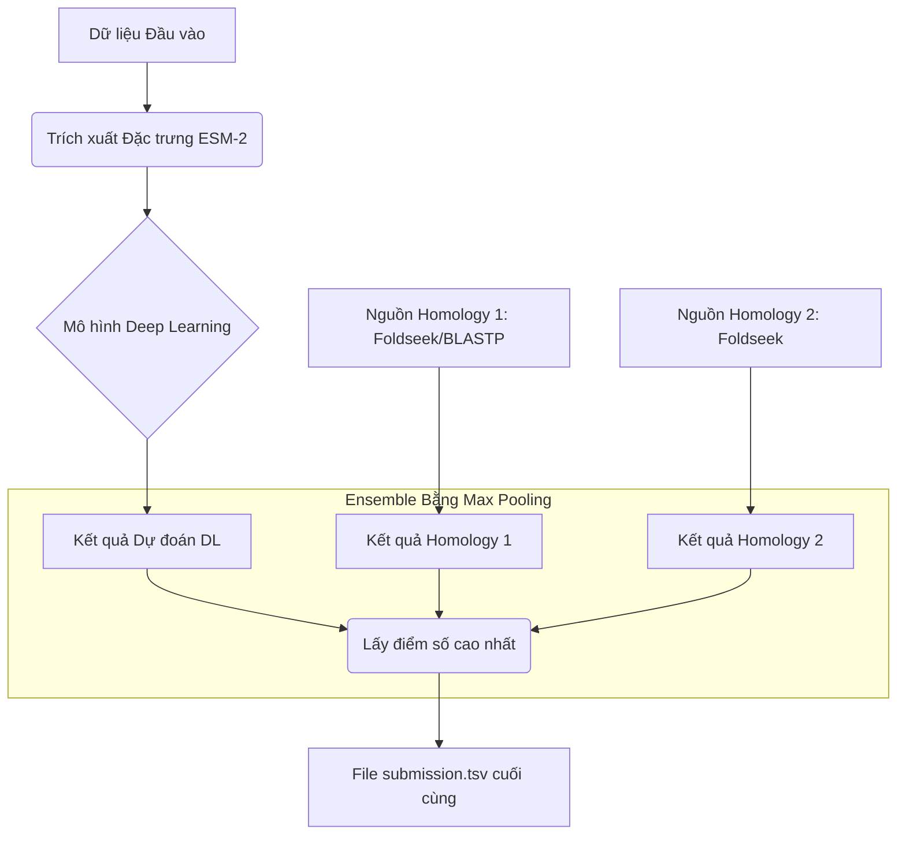

# Dự án Cuối kỳ: CAFA 6 - Dự đoán Chức năng Protein (INT3405)


## 1. Tổng quan Dự án

Đây là repository mã nguồn cho dự án cuối kỳ môn học **INT3405 – Khai phá Dữ liệu và Học máy**. Dự án tập trung vào việc giải quyết bài toán dự đoán chức năng protein trong cuộc thi **CAFA 6 (Critical Assessment of Functional Annotation)** trên nền tảng Kaggle.

Mục tiêu chính là xây dựng một pipeline học máy có khả năng gán các thuật ngữ Gene Ontology (GO terms) cho các trình tự protein chưa được chú thích với độ chính xác cao nhất có thể.

-   **Sinh viên thực hiện:** Nguyễn Minh Đức
-   **MSSV:** 23020049
-   **Giảng viên hướng dẫn:** ThS. Tạ Việt Cường

## 2. Kết quả Đạt được

Dự án đã trải qua nhiều vòng thử nghiệm và cải tiến, với kết quả cuối cùng được ghi nhận trên bảng xếp hạng của Kaggle như sau:

| Tên Nhóm (Kaggle)      | Public Score Cao Nhất | Thứ hạng (Public LB) | Phiên bản tốt nhất     |
| ---------------------- | --------------------- | -------------------- | ---------------------- |
| `ABC_INT34057`         | **0.312**             | **326 / 1073**       | `version 2 - v2.ipynb` |

## 3. Phương pháp tiếp cận (Phiên bản tốt nhất)

Phương pháp đạt kết quả tốt nhất (0.312) là một pipeline kết hợp (ensemble) giữa Deep Learning và hai nguồn dữ liệu tương đồng (Homology) mạnh mẽ.



**Các bước chính:**
1.  **Trích xuất Đặc trưng:** Sử dụng vector embedding tiền huấn luyện từ mô hình ngôn ngữ protein **ESM-2** để biểu diễn mỗi protein.
2.  **Mô hình Deep Learning:** Huấn luyện một mạng nơ-ron đơn giản để dự đoán GO Terms từ các vector embedding.
3.  **Kết hợp Homology:** Lấy kết quả từ hai nguồn dữ liệu homology đã được công bố trên Kaggle.
4.  **Ensemble:** Gộp kết quả từ 3 nguồn trên bằng kỹ thuật **Max Pooling** – lấy điểm số tin cậy cao nhất cho mỗi cặp `(Protein, GO Term)`.

## 4. Cấu trúc Repository

```
.
├── kaggle/
│   └── input/                <-- Thư mục chứa toàn bộ dữ liệu (cần tạo và tải về)
├── version 2 - v2.ipynb      <-- Notebook chính để tái tạo kết quả 0.312 (RECOMMENDED)
├── version-3(4).ipynb        <-- Notebook thử nghiệm với các kỹ thuật xử lý hậu kỳ
├── requirements.txt          <-- Các thư viện Python cần thiết
└── README.md                 <-- File hướng dẫn này
```

## 5. Hướng dẫn Tái tạo Kết quả (Score 0.312)

Đây là hướng dẫn chi tiết để chạy lại code và tạo ra file submission đạt điểm số cao nhất.

### Bước 1: Tải mã nguồn

Clone repository này về máy của bạn:
```bash
git clone https://github.com/nmd29io/CAFA-6-TEAM-ABC_INT34057.git
cd CAFA-6-TEAM-ABC_INT34057
```

### Bước 2: Cài đặt các thư viện cần thiết

Sử dụng file `requirements.txt` đã được cung cấp để cài đặt môi trường:
```bash
pip install -r requirements.txt
```

### Bước 3: Tải và sắp xếp Dữ liệu

Đây là bước quan trọng nhất. Vui lòng tạo cấu trúc thư mục và tải dữ liệu theo hướng dẫn.

1.  **Tạo thư mục `kaggle/input`** tại thư mục gốc của dự án:
    ```bash
    mkdir -p kaggle/input
    ```

2.  **Tải các bộ dữ liệu từ Kaggle** và giải nén vào đúng các thư mục con bên trong `kaggle/input`:

    -   **Dữ liệu chính của cuộc thi:**
        -   **Link:** [https://www.kaggle.com/competitions/cafa-6-protein-function-prediction](https://www.kaggle.com/competitions/cafa-6-protein-function-prediction)
        -   **Giải nén vào:** `kaggle/input/cafa-6-protein-function-prediction/`

    -   **Dữ liệu Embedding ESM-2:**
        -   **Link:** [https://www.kaggle.com/datasets/zcalvin/cafa6-protein-embeddings-esm2](https://www.kaggle.com/datasets/zcalvin/cafa6-protein-embeddings-esm2)
        -   **Giải nén vào:** `kaggle/input/cafa6-protein-embeddings-esm2/`

    -   **Nguồn Homology 1:**
        -   **Link:** [https://www.kaggle.com/datasets/sergeifironov/foldseek-blastp-parthenos](https://www.kaggle.com/datasets/sergeifironov/foldseek-blastp-parthenos)
        -   **Giải nén vào:** `kaggle/input/foldseek-blastp-parthenos/`

    -   **Nguồn Homology 2:**
        -   **Link:** [https://www.kaggle.com/datasets/yuyijiong/foldseek-cafa](https://www.kaggle.com/datasets/yuyijiong/foldseek-cafa)
        -   **Giải nén vào:** `kaggle/input/foldseek-cafa/`

### Bước 4: Chạy Notebook

Mở và chạy toàn bộ các cell trong notebook **`version 2 - v2.ipynb`** bằng Jupyter Notebook hoặc Jupyter Lab.

### Bước 5: Kiểm tra Kết quả

Sau khi notebook chạy xong, file `submission.tsv` sẽ được tạo ra ở thư mục gốc. Đây chính là file đã được nộp lên Kaggle.

## 6. Quá trình Phát triển và Thử nghiệm

Bên cạnh phiên bản tốt nhất, repository cũng chứa các thử nghiệm khác thể hiện quá trình nghiên cứu và nỗ lực "cá nhân hóa" pipeline của em.

-   **Nền tảng `version-3(4).ipynb`:** Phiên bản này là nỗ lực tự xây dựng một pipeline có logic sâu hơn bằng cách cài đặt các module xử lý hậu kỳ dựa trên kiến thức sinh học, bao gồm:
    -   **Negative Propagation:** Loại bỏ các dự đoán sai dựa trên các chú thích "NOT" trong Gene Ontology.
    -   **Hierarchy Propagation:** Lan truyền điểm số dự đoán lên các thuật ngữ cha trong cây phân cấp GO.
    Mặc dù điểm số của hướng đi này thấp hơn (cao nhất là **0.257**), nó thể hiện sự hiểu biết sâu sắc về cấu trúc và quy tắc của bài toán.

-   **Thử nghiệm với Mô hình Chuyên biệt (Multi-Ontology Approach):** Em cũng đã thử nghiệm một hướng tiếp cận khác về kiến trúc mô hình. Thay vì huấn luyện một mô hình chung cho tất cả các GO Terms, em đã:
    1.  Phân loại các GO Terms trong tập huấn luyện thành 3 nhánh Ontology chính: **Biological Process (BPO)**, **Molecular Function (MFO)**, và **Cellular Component (CCO)**.
    2.  Huấn luyện **ba mô hình riêng biệt**, mỗi mô hình chuyên trách dự đoán các thuật ngữ trong một nhánh Ontology.
    3.  Kết hợp kết quả dự đoán từ cả ba mô hình chuyên biệt này.

    **Kết quả:** Như trong lần nộp bài `Version 4 | Version 9 Multi-Ontology` (score **0.184**), phương pháp này cho kết quả thấp hơn. Điều này cho thấy với kiến trúc hiện tại, một mô hình tổng quát duy nhất lại hiệu quả hơn trong việc học các đặc trưng chung giữa các nhánh Ontology. Tuy nhiên, đây là một thử nghiệm quan trọng để khám phá các hướng đi tối ưu hóa khác nhau.
